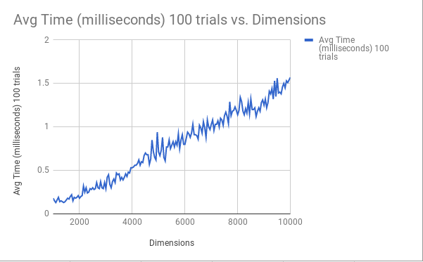
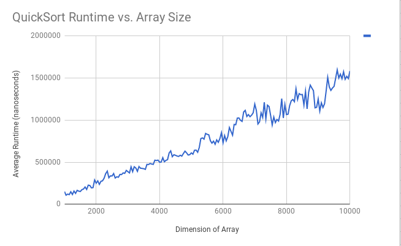

# TidePodLab
## TidePods (Fiona Cai, Selina Zou, Eddie Zhu)
### Lab #01 -- What Does the Data Say?

## Hypothesis
The best case scenario is O(n), and the worst case is O(n^2). The average runtime will be about O(nlogn). 

## Background
The QuickSort sorting algorithm uses the partition algorithm which sorts an array based on the pivot position. The pivot position is in it's final resting position and the elements to its left are smaller while the elements to the right are larger. QuickSort divides and concurs by recursively calling itself on each half of the partitioned array. Since the partition method runs in O(n), and is ran logn times due to the division, it's average time will be O(nlogn). 

## Experiment Methodology
A random array will be generated based on size, and the sorting algorithm will be timed while sorting the array. For each array of size 1000 to 10000, in increments of 50, we ran Quick sort for 100 trials and outputted the average runtime in nano seconds. 

## Results 

*(time measurements and analysis)*

## Conclusions
The graph depicts an nlogn relationship, and looks almost linear. The efficiency comes from the fact that the sort divides and conquers the array and recursively sorts each section. Slight dips and rises in times might stem from the different possible positions that the elements are in. Arrays that start off being "more sorted" have a faster runtime than those who aren't. 

*(analysis of raw data and concise explanations)*
*(mention any results that are unexplanable)*

