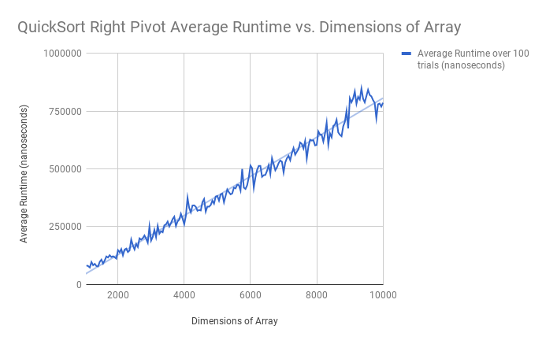

# TidePodLab
## TidePods (Fiona Cai, Selina Zou, Eddie Zhu)
### Lab #01 -- What Does the Data Say?

## Hypothesis
The best case scenario is O(nlogn), and the worst case is O(n^2). The average runtime will be about O(nlogn).

## Background
The QuickSort sorting algorithm uses the partition algorithm which sorts an array based on the pivot position. The pivot position is in it's final resting position and the elements to its left are smaller while the elements to the right are larger. QuickSort divides and concurs by recursively calling itself on each half of the partitioned array. Since the partition method runs in O(n), and is ran logn times due to the division, it's average time will be O(nlogn).

Our QuickSort algorithm used the rightmost element as the pivot.

We predict that if the pivot chosen each time is the smallest or largest element, this would be the worst case.
Runtime O(n^2) because for each call, you split the array into 0 and n-1 sizes. The best case would be if the pivot
chosen each time is the value that divides partitions the array into two equal pieces. The associated runtime
would be O(nlogn) as for each call, you are cutting the array into halves. Quicksort will usually have a runtime
of O(nlogn) because on average, a random pivot will divide the subsequent array into half, thus resulting in log n divides.

## Experiment Methodology
A random array was generated based on size, and the sorting algorithm was timed while sorting the array. For each array of size 1000 to 10000, in increments of 50, we ran Quick sort for 100 trials and outputted the average runtime in nano seconds.

## Results

Our data from our trials is also in the repo under TidePods Lab#01 QuickSort - Right Pivot.csv

## Conclusions
The graph depicts an nlogn relationship, and looks almost linear. The efficiency comes from the fact that the sort divides and conquers the array and recursively sorts each section. Slight dips and rises in times might stem from the different possible positions that the elements are in. Arrays that start off being "more sorted" have a faster runtime than those who aren't.
